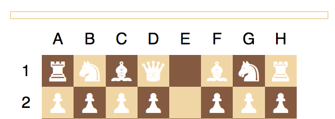
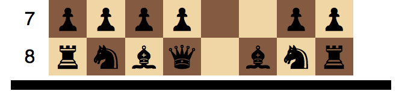
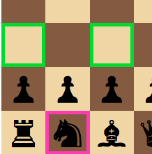
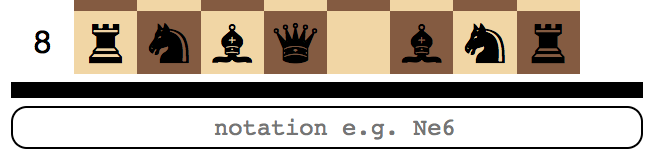
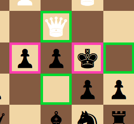
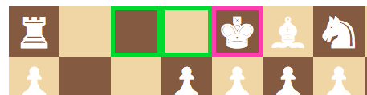
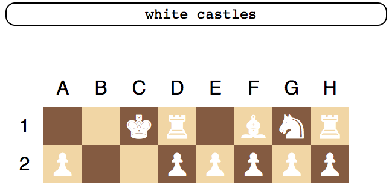
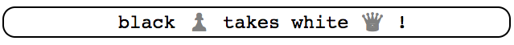

# Chess
A vanilla Javascript implementation of chess.

## How to play
A turn indicator, above or below the board, shows whose turn it is.

When it's white to play:

When it's black to play:

To move a piece, click on it and a set of possible moves will be highlighted for a few seconds. In the example below, black has selected to move the knight, shown in pink, and the available squares are shown in green.

After selecting a piece, the piece can be moved by clicking on a valid destination square.

## Moving with chess notation

Alternatively, moves can be made by entering chess notation into the box at the bottom of the screen:

## Hints to escape check

If the current player is in check, a `hint` button appears which will all moves which can escape check. In this example, the available moves are for the E pawn to take the queen, or for the king to move right or down-left. As before, the piece to move is indicated in pink and the destination squares in green.

## Castling

To castle, select to move the king and choose the square which the king ends on after castling.

Castling can be done on the king's side or, as shown below, on the queen's side.

By selecting the left-most square (the square which is two away from the king's current position), castling occurs:

## The message bar

Various statuses, like `check` or `checkmate` are shown in the message bar at the top of the screen.

If the previous move resulted in no message, the move itself is shown:

# Known issues

* After checkmate, play continues, but every move the checkmated player makes results in the message `This move does not prevent check`.
* Pawns cannot take *en passant*.
* Pawns are not promoted when they reach the final row.
